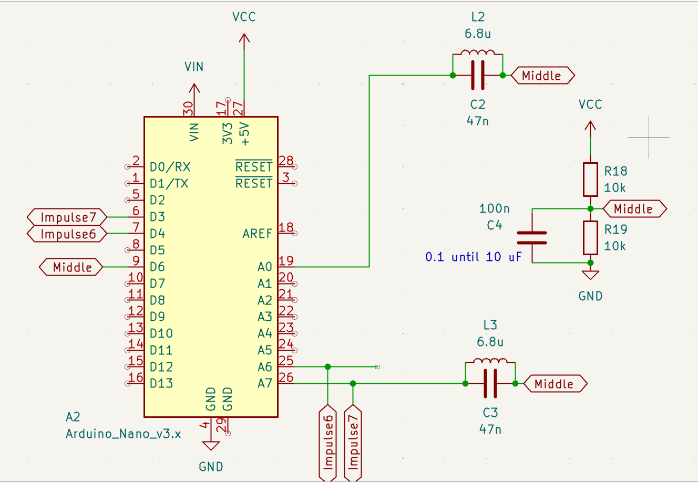
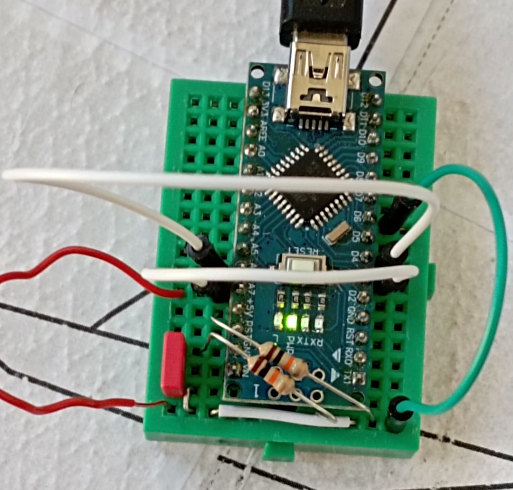
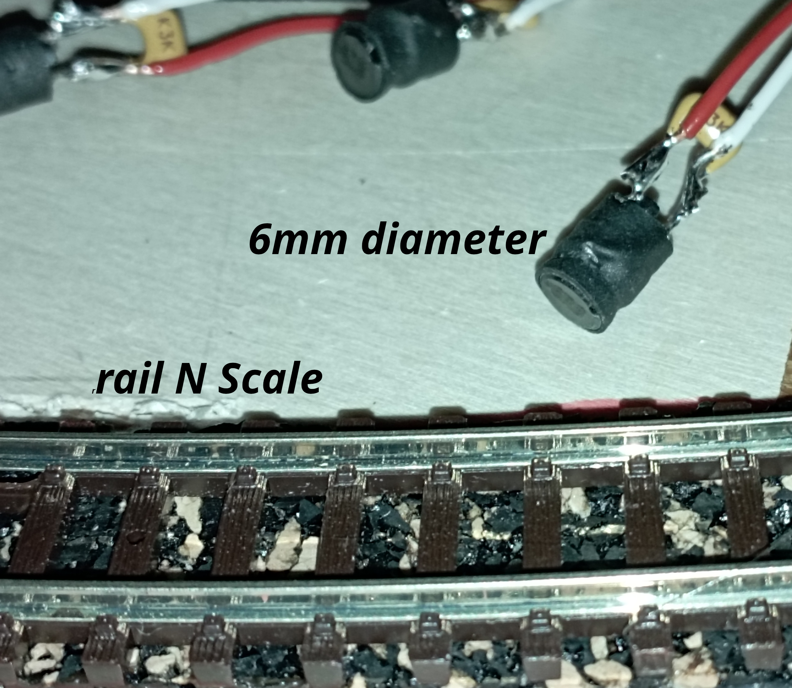
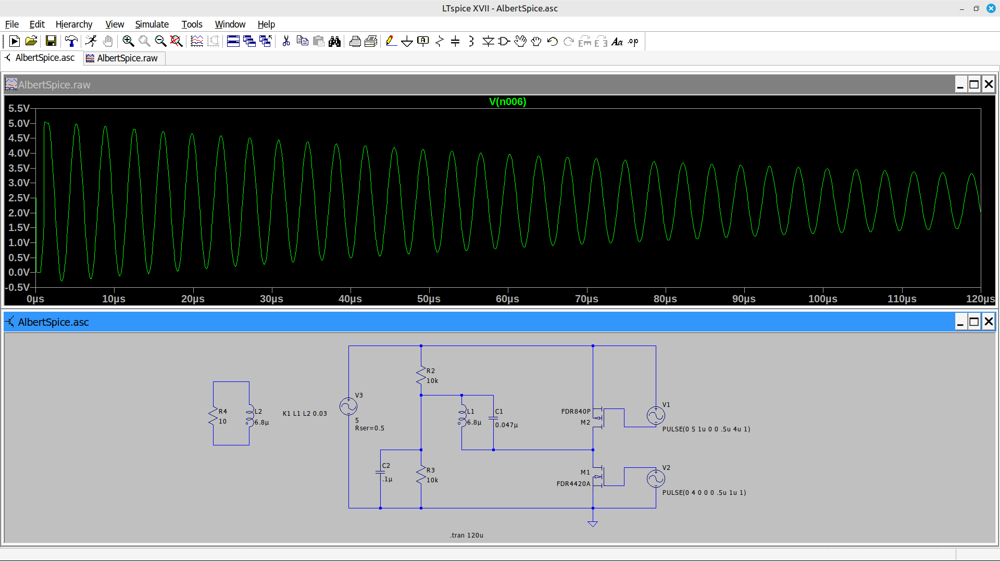
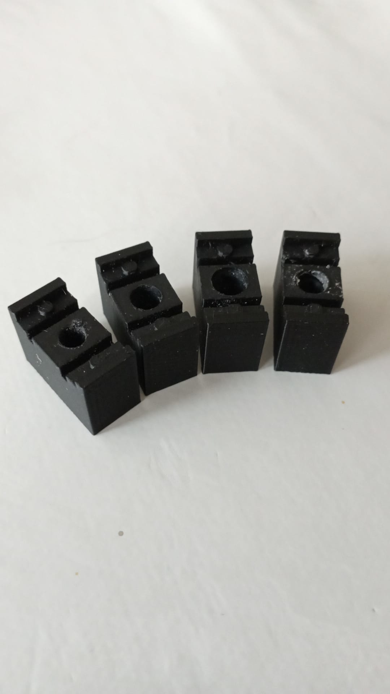
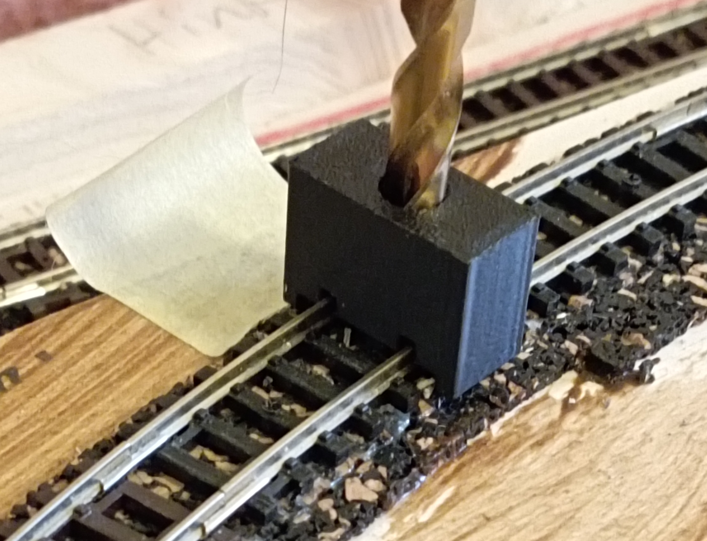
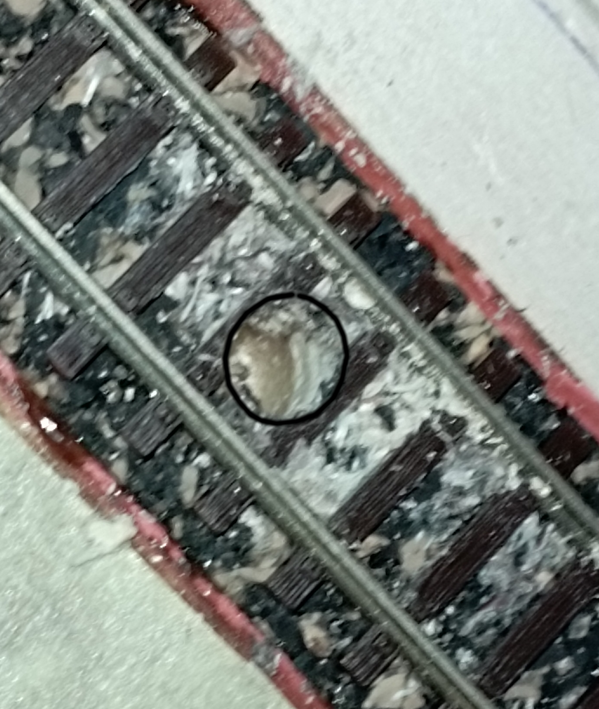

## License
The software is based on ideas in the MIT licensed software 
  "Schrankensteuerung Zustandsautomat Schrankenbewegung"
          Copyright (c) 2025 Albert Messmer
          but fully rewritten by Andreas Mascheck
          under

## GNU GPL V3

Copyright (c) 2026 Andreas Mascheck

---

## Description
Class to use an Arduino Nano as a 8 channel LC proximity sensor

---

## ⚠️ Hardware Considerations

This project **requires physical I2C pins**:

| MCU              | I2C Pins       | Available LC Inputs |
|------------------|----------------|---------------------|
| ATmega328P       | A4 (SDA), A5 (SCL) | A0–A3 A6-A7              |
| ATmega328PB      | A4/A5 + SDA1 (D23), SCL1 (D24) | More flexible |

- Newer Nano boards with **ATmega328PB** provide a second I2C interface  
- Availability of Nano V4 (328PB) may be limited → choose hardware carefully
- if you do not need A4/A5 you may use it for LC_Sensor
>⚠️ the code for Nano V4 was only to compile with:

Arduino IDE Version: 2.3.8
>Date: 2026-02-25T15:15:50.003Z
>CLI Version: 1.4.1
>Copyright © 2026 Arduino SA

---
## Electronics Overview

* **One pin** set to **2.5 V midpoint reference** (sensor base)
* **Pulse pin** drives the LC resonator; output monitored via analog input
* **Arduino Nano**: A0–A7 analog inputs, D3/D4/D6 for pulses, optional A4/A5 for I2C
* **LC circuit wiring**: up to 1 m using twisted-pair cable

- Circuit diagram   

- Circuit real 

- soldered sensor

## 🔧 Circuit & Components

- LC oscillator per sensor  
- Example values:
  - **Inductor:** 6.8 µH  axial
  - **Capacitor:** 47 nF  Ceramic, e.g., C327C473K3G5TA-ND or CL21B473KBCNNNC
- Resonance: ~280 kHz 
- see the circuit diagram - you need additional 2 x 10kOhm and 1 x 100nF per Arduino Nano

> Higher frequencies are not recommended due to MCU interrupt limits.

## 🚀 Overview

`LC_Sensor` is a library for **LC-based metal detection** for model railway occupancy sensing. 

- Sensing distance **1...3 mm**
- Supports **Arduino Nano / Pro (AVR)**
- Up to **8 proximity sensors**
- Minimal wiring: **2 wires per sensor**

---

## 🔍 Why LC Sensors?

Common alternatives have drawbacks:

| Method            | Drawback |
|------------------|----------|
| Light barriers    | Bulky, requires extra electronics |
| Hall sensors      | Require magnets on locomotives |
| Track detection   | Requires rail isolation + wiring |

### ✅ LC Sensor Advantage

- Fits into a **5.7 mm hole between rails**
- No track modification required  
- Simple wiring (twisted 0.6 mm wire)  
- Fully hidden installation  

---

## ⚙️ Features

- eventually analog Input at arbitrary Analog Pin
- LC-based detection on analog pins

### Pin Usage

| Pin Type        | Function |
|----------------|----------|
| D6             | Reserved (internal use) |
| D4             | Bridged to A6 |
| D3             | Bridged to A7 |
| Digital Pins   | Input/Output (no pull-ups!) |
| A0–A7          | LC proximity inputs (virtual digital) |
| A0-A7          | Fast analog input (0–255) |

> ⚠️ Internal pull-ups are disabled due to interference with LC oscillators and the request for pull-up will be ignored without any notice.

---

## ⏱️ Detection Principle (Version 5+)

### Measurement Cycle

- **Scan rate:** ~400 Hz per sensor (8 sensors × 400 Hz each = 3.2 kHz total ISR rate)
- **Sensor window:** ~2.5 ms per sensor
- **Oscillator frequency:** ~280 kHz (LC resonator)
- **Observed maximal count** ~50

### Signal Processing Pipeline

**Version 5+ introduces robust ring-buffer filtering:**

1. **Pulse Generation** (1.5 µs total)
   - 0.5 µs LOW: Discharge LC circuit
   - 0.5 µs TRISTATE: Allow settling
   - 0.5 µs HIGH: Excite oscillator

2. **Zero-Crossing Detection** (~75 falling edges per measurement cycle)
   - Analog comparator counts falling flanks
   - Result: Counter value (0–50+)

3. **Ring Buffer Filtering** (32-sample moving average)
   - Stores 32 consecutive measurements per sensor
   - Provides 80 ms history window
   - Smooth, noise-robust baseline tracking

4. **Symmetric Rounding**
   - Rounding rules optimized for symmetric rise/fall behavior
   - Prevents false triggers from unbalanced averaging

5. **Calibration & Baseline Establishment**
   - Auto-calibration mode: Measures inactive state on reference sensor (default A0)
   - All sensors inherit same physical characteristics
   - Alternative: User-supplied baseline via `zero` parameter

### Signal Evaluation

**Detection Logic:**

| Condition | Action |
|-----------|--------|
| Baseline established | Enter STATE_RUNNING |
| Baseline unknown | STATE_CALIBRATION (auto-measure 50+ cycles) |
| `delta < threshold` | Increment trigger counter |
| `delta ≥ threshold` | Reset trigger counter to 0 |
| Trigger counter ≥ repeat | Output signal (holdTime cycles) |

**Default Parameters:**
- **Threshold:** 2 (deviation from baseline)
- **Repeat:** 1 (consecutive detections required)
- **Hold Time:** 200 (in 1/400 second units = 500 ms)

### Example: Metal Detection

- Signal simulation (train vs no train)

---

### Signal Flow Diagram

Timer2 ISR (400 Hz) ↓ Select Channel → Initialize LC Stroke ↓ Analog Comparator counts zero-crossings ↓ Next Cycle: StoreChannel() ↓ Ring Buffer Update (32 samples) ↓ Moving Average Calculation ↓ Delta vs. Baseline ↓ Trigger Logic (repetition filter) ↓ Output: signalLevel[ch] = holdTime ↓ User reads via: LC_Sensor.read(ch)

## Usage

1. Connect coils and capacitors as LC resonators between rails.
2. Connect Arduino Nano (pins as above).
3. Run SensorTester5 firmware.
4. Test and calibrate 

---

## 📊 Visuals

- LTSpice Simulation 

- Example components  

- Sensor between N scale rails

[Watch the video](pictures/ArdNano_LC_Sensor.mp4)
- Sensor between N scale rails

- Drill guider, better to make it precise without any hassle  

    

*(See `/docs` or images in repository)*

---

## 📚 Documentation

---

## 💡 Notes

- Usable inside **Arduino program**
- Focused on **LC sensor inputs**
- Designed for **N-scale model railways**

---

## 📖 Reference

> “The product of inductance and capacitance must not be too small, as it determines the resonance frequency. Smaller LC values increase frequency.  
> With 6.8 µH and 47 nF, the frequency is ~280 kHz—still manageable for a 16 MHz ATmega via interrupts. Higher frequencies are not recommended.”  
> — A. Messmer, 2025

Documentation edited and improved with AI assistance (ChatGPT, OpenAI), 2026
